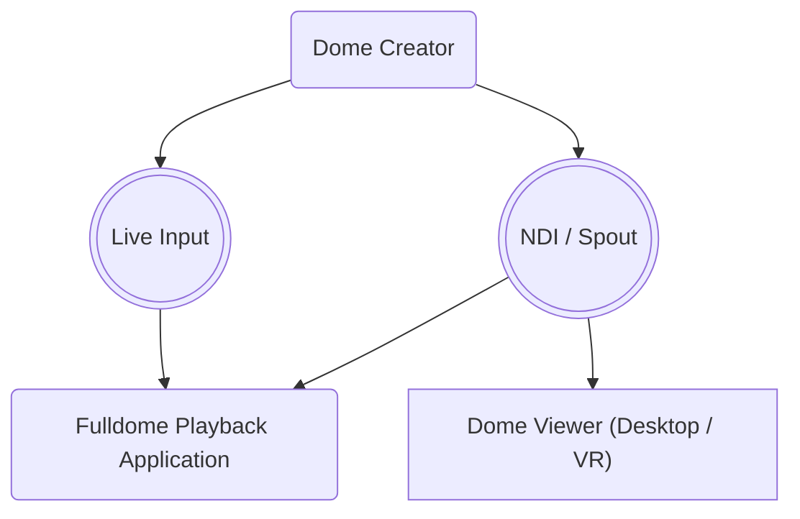

# Dome Tools: Dome Creator and Dome Viewer

This repository contains two main components:

- The **Dome Creator** Unity package, a highly efficient realtime fulldome toolkit.   
  It has two modes: **Dome Warp** – a novel single-view rendering technique, and a traditional **cubemap-based** approach. The toolkit supports **BiRP, URP, and HDRP** render pipelines, and is provided as easy-to-use UPM package. It outputs both audio and video as realtime NDI streams ready for display on a dome.  

- A **Dome Viewer** virtual planetarium compatible with Windows, Quest 2, 3 and more. It can receive **NDI streams**, **Spout sources**, and display local **video and image files**. The viewer is provided as executable for Windows as well as VR app on Meta App Lab and SideQuest, or can be modified and compiled from source.  

**Dome Creator** and **Dome Viewer** are developed and maintained by [prefrontal cortex](https://prefrontalcortex.de).  

## Getting Started

Use **Dome Creator** to produce real-time, interactive fulldome content. Stream it over the network with **NewTek NDI** and view your content in **Dome Viewer** and other NDI-enabled applications.

1. **Add Dome Creator to your project.**
   Add the Dome Creator package to your Unity project using the installer:    
   [Download Dome Creator for Unity – Package Installer 📦](https://package-installer.glitch.me/v1/installer/OpenUPM/com.pfc.dome-tools?registry=https://package.openupm.com)

2. **Add the "Dome Tools" prefab to your scene.**  
   You can find the prefab under `Packages > pfc Dome Tools > Runtime > Dome Tools`.  
   Position , rotate, and scale the object to fit your scene.   
   See the [Dome Creator](#dome-creator) section for more details on how to use this package.  

3. **Install the NDI packages**
   Select Dome Tools and click <kbd>Fix</kbd> next to "NDI Package is not installed". This will install the `KlakNDI` package. 

3. **(Optional) Learn from the samples**
   Open `Window > Package Manager` and select the `pfc Dome Tools` package.  
   Unfold the `Samples` section, then import the sample labelled "Import this first!".  
   Now, import the sample for your current render pipeline (BiRP, URP, HDRP).  
   Samples will be copied to your project's `Assets / Samples / pfc Dome Tools` folder.  

4. **Create content.**  
   Create your scene, animate the dome rig or its parameters, create and animate postprocessing effects, place and animate audio sources, and so on. Iterate quickly by previewing your content in the **Dome Viewer**.

5. **Preview and showcase your content**  
   By default, your content gets streamed with NDI on your local network for easy viewing. Use the **Dome Viewer** to display the output on a Virtual Dome either on desktop or in VR, or display the NDI stream on a physical dome directly.     

Typically, you will use the **Dome Creator** package in your Unity project, and start the **Dome Viewer** app on Quest 2/3 in the same local network. Once you're ready, the same NDI stream can be received by many planetarium AV systems directly – in realtime. 

## Download and Installation

### Creating content
[Download Dome Creator for Unity – Package Installer 📦](https://package-installer.glitch.me/v1/installer/OpenUPM/com.pfc.dome-tools?registry=https://package.openupm.com)  

### Supported **Unity versions**  
- ✅ Unity 2021 LTS
- ✅ Unity 2022 LTS
- ❌ Unity 6.0 (not supported yet)

### Supported **Render Pipelines**
- ✅ Built-In Render Pipeline (BiRP), 
- ✅ Universal Render Pipeline (URP), 
- ✅ High Definition Render Pipeline (HDRP)

### Verified **Dome Systems**
[Learn more about setting up your Dome System for realtime video and audio.](#output-to-a-dome-av-system)

- ✅ **Pixera 1.8+ and 2.x+**  
      Dome Master via NDI and multi-channel audio via NDI.
  
- ✅ **Spatial Audio Designer by New Audio Technology**  
      Multi-channel audio via NDI-to-ASIO bridge or ASIO-to-Dante and object positions via ADM-OSC.
- ✅ **Vioso Player 2.x+**  
      Dome Master via NDI. Currently no audio support, but NDI-to-ASIO can be used.
- ✅ **L-ISA**  
      Multi-channel audio via NDI, object positions via ADM-OSC  

### Viewing content 
[Download Dome Viewer for Windows](https://github.com/prefrontalcortex/DomeTools/releases/tag/release%2F1.1.1-Applab-Release)  
[Download Dome Viewer for Quest 2/3/Pro from App Lab](https://www.meta.com/experiences/4747161018651543/)    
[Dome Viewer on SideQuest](https://sidequestvr.com/app/34419/dome-viewer)   

The viewer supports both **Desktop usage** and **VR usage** with **hands or controllers**.  
It has been tested on **Windows** (with and without VR), **Quest 2/3/Pro**, and **Pico 4**.  

For VR support on Windows, use an **OpenXR-compatible headset and runtime** (for example, headsets supported by the Oculus App or Steam VR).  

## Dome Creator

This package provides a **highly efficient realtime fulldome toolkit** for Unity. It allows you to **create, transmit and view** fulldome video and audio in real-time. Together with **Dome Viewer**, it's part of the **Dome Tools** suite by prefrontal cortex. 

It has two rendering modes: 

1. **Dome Warp ⚡ – A novel single-view dome-invariant rendering technique**
   - Much faster (single view)
   - Can be used with postprocessing effects without visible seams
   - Can be used with volumetric effects   
   - Excellent for real-time applications  
   - Best suited for spatial content (content that is around the viewer, not just on the floor plane)  
   - View angle is limited to 180°  
   - Ability to art direct the perceived depth of the scene
   
2. **Traditional Cubemap-based approach 🔮**
   - Much slower (has to render 5 or 6 individual views depending on angle)  
   - Postprocessing with local effects will lead to visible seams
   - Best suited for horizon-focussed content (e.g. streets, landscapes)
   - Fixed viewpoint (center of the dome)
   - Flexible view angle (up to 360°)  

Both result in a fulldome projection in the common "Dome Master" format (formally known as _Equidistant Azimuthal Fisheye Projection_). 
The toolkit supports BiRP, URP, and HDRP render pipelines, and is provided as UPM package.  

Content can be streamed via [NDI](https://ndi.video/tools/download/) to a physical dome or [viewed on a simulated dome](https://github.com/prefrontalcortex/DomeTools/?tab=readme-ov-file#dome-viewer) in VR or on a desktop monitor. 

### Camera Rig Usage

The **Dome Tools** prefab contains several components that together form your camera and streaming setup.  

Use **Dome (camera rig)** prefab as camera to position in your scene.   
The camera is your viewer's position. It can of course be animated, for example via Timeline / Playable Director.  

**Canvas (Dome Master)** combines the rendered image with UI elements into the final dome master image.

**Canvas (Final Output)** is the final output for your dome. You can use it for testing or for rendering to disk. 

**NDI Sender** streams out the dome master texture and the audio signal to a virtual or physical dome. 

> **Note:** [NDI](https://newtek.com) is a high-bandwidth protocol. For best results, use a wired network connection. Audio support is currently experimental.  

### Producing real-time dome content

We recommend streaming to your physical or virtual dome via NDI in 4k or higher (depending on your media server / machine).

### Producing pre-rendered video content

Depending on your needs, you can either:

a) Use Unity Recorder and record the DomeMaster render texture into a video or image sequence
b) Use a hardware capture card to capture the monitor output
c) Capture the NDI stream directly using NDI Tools or an external software

## Dome Viewer

This tool together with the **Dome Creator** package is part of the **Dome Tools** suite by prefrontal cortex. 
It is mainly used for screening dome content while creating it without having a dome available. It's unique main feature is receiving a NDI livestream from any source of your network.
This allows simultaneously editing your dome content and watching it on your target medium. 

### Features
- receiving a NDI stream with video and audio live from your ndi capable editing software
- you can watch the same stream which is send for dome screening
- receiving surround sound also if you don't have any surround sound device
- first person moving inside your dome
- outside view
- choose between different dome sizes and seating setups
- use VR for full dome experience
- Desktop and VR mode at the same time (useful for presenter situation)
- standalone build for standalone VR devices (Meta Quest 2 and above)
- playback videofiles / images from local drive
  

### Viewing content 
[Download Dome Viewer for Windows](https://github.com/prefrontalcortex/DomeTools/releases/tag/release%2F1.1.1-Applab-Release)  
[Download Dome Viewer for Quest 2/3/Pro from App Lab](https://www.meta.com/experiences/4747161018651543/)    
[Dome Viewer on SideQuest](https://sidequestvr.com/app/34419/dome-viewer)   

The viewer supports both **Desktop usage** and **VR usage** with **hands or controllers**.  
It has been tested on **Windows** (with and without VR), **Quest 2/3/Pro**, and **Pico 4**.  

For VR support on Windows, use an **OpenXR-compatible headset and runtime** (for example, headsets supported by the Oculus App or Steam VR).  

### Desktop Controls

**Menu**

- Media Sources: (choose between ndi and local files) - **don't forget to refresh!**
- Environment: select between domesize / seating setup / projector on-off
- Real Size View / Miniature View: toggle between first person and outside view
- ? / About: Description and version number

**Movement**
- WASD - Move
- Mouse Drag - Rotate
- Mouse Wheel - Field of View / Zoom

### VR Controls

**Menu**

see desktop menu

**Movement**
Input via Controller:
- left menu - dome viewer menu
- right menu - system menu
- right stick front - teleport
- right stick left - rotate 90° left
- right stick right - rotate 90° right
- right stick back - rotate 180°
- left stick - movement in all directions

Input via hands:
- left menu gesture - dome viewer menu
- right menu gesture - system menu
- teleport gesture - teleport

### Media Playback on Quest ###

It is recommended using the NDI Workflow for watching Dome Content on your Quest Device. If you have NDI Tools installed you can use VLC Player (https://www.videolan.org) with NDI Output.

1. Install NDI Tools (always recommended) - https://ndi.video
2. Install VLC Player (if you haven't already) - https://www.videolan.org
3. Go to Tools -> Settings -> Video -> Output -> Set to NDI Video Output
4. Repeat with Audio
5. Play your video, there will be a new NDI Stream named YOUR COMPUTER / VLC.

The PC Screen will be black without any output. This is normal.

For Local Playback on your Quest Device you have to get access to the local storage.

1. Connect your quest with your computer (usb)
2. Open the device storage with your computer
3. place your media files to "Download/DomeViewer/" (jpg, png or mp4)
4. In the Domeviewer App click the refresh Button next to the media dropdown on media sources
5. choose the media file you want to show (image or video)

## Output to a Dome AV System

> **Under construction 🏗️**  
This section will contain information regarding various dome systems and how to display NDI content on them.  
 If you want to provide steps for your dome system, please [open an issue](https://github.com/prefrontalcortex/DomeTools/issues/new/choose) or make a pull request.  

NDI is a widely supported protocol for streaming video content. It is supported by many dome systems. Please refer to the docs of your dome system for instructions on how to receive NDI streams.  

### Pixera

In addition to NDI Video, Pixera supports multi-channel NDI Audio.  

- ✅ Pixera 1.8.x
- ✅ Pixera 2.0.x

## Audio Support

Select an audio mode from `NDI Sender` in your scene. You can either use your local PCs sound card to produce surround audio (e.g. 5.1 or 7.1), or you can use our Virtual Audio to stream an arbitrary amount of channels via NDI Audio in lockstep with the video signal. There are a number of predefined arrangements for Virtual Mics, but you can provide a custom one for your particular dome system.  

### Native Spatialization

If your sender system is capable of generating surround sound, you can use Unity's native AudioListener in 5.1 or 7.1 mode and stream the resulting tracks over NDI Audio.

### Virtual Audio

Often, the sender system is not capable of generating surround sound. In this case, you can use our Virtual Audio to stream an arbitrary amount of channels via NDI Audio in lockstep with the video signal.

You can change the audio send settings in `NDI Sender` component from the Dome Creator prefab:

This system will places virtual microphones in the scene to capture the audio and mixes it to the outgoing NDI audio channels. 
To capture the audio from the `AudioSource`s, it's important that all `AudioSource`s must have the `AudioSourceListener` component. Per default, when starting playmode, the `NDI Sender` component will search for all `AudioSource` components and add the `AudioSourceListener` component to them. When you load at runtime prefabs which contains `AudioSource`, you should add the `AudioSourceListener` component by yourself. There is also a add button on the `AudioSource` component for this.

This Virtual Audio system supports most of the `AudioSource` settings. 
Not supported are: 
- Audio Mixer
- Spatializer Plugins
- Ambisonic Audio Files (can be played, but get handled as mono)
- 3d Sound Settings: Spread, Priority, Stereo Pan
  
When you want to use filters/effects, you can use the legacy Unity filter components. Just make sure the components are ordered before the AudioSourceListener component.  
 

Is it also possible to create custom speaker setups when 5.1 or 7.1 is not enough. Just select "Speaker Config Asset" as Audio Send Mode in the `NDI Sender` component. Then you can create a Speaker Config Asset (Assets > Create > SpeakerConfig) and assign them to the `NDI Sender`. 

Here you can add your speaker positions (positions are relative to the center in meters). They are organized in groups for better overview, but it's not  necessary to use more than one group. Regardless of the groups, the first speaker will have channel number 0, the second speaker channel number 1 and so on.
With audio mode "Custom Virtual Audio Setup" you can setup the speaker by script. In C# use "VirtualAudio.AddListener" method to add a speaker. You will also find some settings in the VirtualAudio static class.
 
> **The speaker positions will be included in the Audio Metadata when sending audio with Ndi. The Dome Viewer automatically creates a setup from this data to simulate the corresponding speaker setup.**  

### Object Based Audio

> **Object Based Audio also uses the Virtual Audio system. For `AudioSource` setups and limitations please read the "Virtual Audio" section**  

Products like the [Spatial Audio Designer Processor](https://www.newaudiotechnology.com/products/spatial-audio-designer-processor/) from New Audio Technology is capable of receiving individual audio objects as separate tracks and placing them in a 3D space. This moves the spatialization to the end of the audio processing stage and cam improve acoustic quality considerably.  

To send audio to the SAD Processor, you need to send the audio as separate tracks. This can be done by change the "Audio Send Mode" at the `NDI Sender` component to "Object Based" in the Dome Creator prefab.

The audio object positions will be send within the NDI Audio Metadata or optional with ADM-OSC over the network. To use ADM-OSC, you will need to install the OSC Jack Package (install button can be found on `NDI Sender` when "Object Based" is selected) and also add the `Adm Osc Sender` component (can also be added via `NDI Sender` with the "Add ADM OSC Sender Component" button)

Please don't forget to create a OSC Connection asset and assign them to the `Adm Osc Sender` component!

The ADM-OSC position data will contain both the spherical and the cartessian position. Distance will be send normalized by the range from near and far distance settings.

> **The Dome Viewer doesn't need ADM-OSC to play Object Based Audio from the Dome Tools. The `NDI Receiver` uses the included Audio Meta Data for object positions.**  

## Contributing

### Testing and developing the Dome Tools package

The `package` folder contains the UPM package for Dome Tools.   
To work on the package, open one of the test projects inside `projects/DomeTools*`, for example <kbd>DomeTools-2021.3</kbd>.  
These projects already contain a local reference to the package, so all changes to the package will be shared between the test projects.  

Before making a package release, make sure to rename the `Samples` folder to `Samples~`. This will hide the folder inside Unity, and allows users of the package to install the provided Samples from the Package Manager window. When installing a sample, Unity will copy the files to the project's `Assets` folder, out of the immutable package folder.  

### Testing and developing the Viewer

The `projects/DomeViewer` folder contains the Unity project for the Virtual Dome Viewer. It currently uses Unity 2021.3 LTS.  

Before opening the project, **make sure you have git installed** since the project references a git package – [learn more](https://docs.unity3d.com/Manual/upm-git.html).  To work on the viewer, open the project inside `projects/DomeViewer`. Required packages will be installed automatically.

> **Note**: If you get a warning regarding the klak.ndi package not being installed, please install git first as described above.  

### Building

When building for Android, make sure to provide a unique application identifier and either your own signing key or a development key. A custom Android manifest is provided that allows network access to receive NDI streams.  

## Further Reading
- [Interactive Domes – Fulldome Festival Presentation 2020/2024](https://www.youtube.com/watch?v=vjvYJ7hgbyo)
- [NewTek NDI](https://ndi.video/)
- [Fulldome on Wikipedia](https://en.wikipedia.org/wiki/Fulldome)

## Contact Us
- dometools@prefrontalcortex.de
- [@prefrontlcortex](https://twitter.com/prefrontlcortex) and [@hybridherbst](https://twitter.com/hybridherbst) on Twitter
